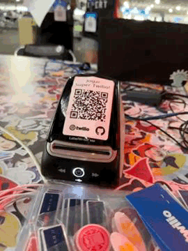

# Super Twilio

Este foi um game desenvolvido para interação com participantes da Campus Party Brasil nos dias 11 a 15 de Novembro de 2022

O jogo era baseado nos atributos Gamer, Geekm=, Tech, Arte e Bizz, que se conectam com as áreas temáticas da Campus.
Ao se cadastrar, cada participante deve distribuir 100 pontos entre essas 5 categorias. Com isso, ele cria seu "card" para jogar.

Também é possível imprimir seu cartão de jogo para que outras participantes possam ler o código QR e criar uma partida.
O sistema automaticamente seleciona um dos atributos e vence quem tiver mais pontos no atributo escolhido.

## Como foi desenvolvido

### Tecnologias Utilizadas
* *API de WhatsApp da Twilio*: para receber e enviar mensagens pelo WhatsApp
* *Twilio Studio*: para construção da estrutura de registro e da partida
* *Twilio Functions*: nosso backend serverless para acesso ao Firestore e API do GitHub para validar o username
* *Firebase Firestore*: armazenamento dos cartões e partidas
* *DYMO Api*: para impressão das etiquetas

### Estrutura de Pastas
* `/functions`: códigos do nosso backend que foi publicado na Twilio Functions
* `/scripts`: códigos para impressão local e envio de mensagens de avisos para participantes

 